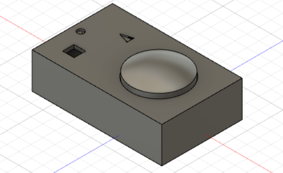

Smart Doorbell
===
  
  
Introduction
---
This project was created for ECE 473 under Professor Shaout and UM-Dearborn. It is a multithreaded C++ application to be run as 
embedded software on a Raspberry Pi that utilizes OpenCV and acts as a doorbell that can:
* Ring when a button is pressed
* Stream video over WiFi using sockets to another UNIX-like device
* Turn a light on when it is dark outside
* Detect motion and save a quick video when motion is detected
* Save the last 24 hours of video all the time

Building
---
0. Make sure all requirements are satisfied:
  * [Raspberry Pi OS: Raspbian](https://www.raspberrypi.org/downloads/)
  * [OpenCV](https://opencv.org/) `sudo apt install libopencv-dev`
  * [CMake](https://cmake.org/) `sudo apt install cmake`
1. Clone the project `git clone github.com/rocketmax/smart-doorbell`
2. Open the project `cd smart-doorbell`
3. Prepare CMake `cmake .`
4. Build the project `make`

Wiring
---
* The LED should be wired in series with a resistor between `GND` and `GPIO0`
* The button should be wired between `VCC` and `GPIO1`
* The camera will be connected to the `camera` ribbon slot on the board

Running
---
Run using `smart-doorbell/doorbell`

To set up running automatically at boot time, see this [autostart](https://learn.sparkfun.com/tutorials/how-to-run-a-raspberry-pi-program-on-startup#method-2-autostart) documentation

To connect to the server from your device, compile the `networking/receiver.cpp` file with the IP address of your Pi entered, then run the file while connected to the same network as the PI. This has only been tested to work on UNIX-like systems. You will also need OpenCV on your host computer to be able to compile the program and view the live images

Viewing Recordings
---
To view the recordings that the Pi has taken while operating, access the MicroSD card from the Pi. The recordings are stored in `~/smart-doorbell/recordings`. In this folder, the `.mp4` files from all detection motion events are saved with their date and time. The complete recordings (saved hourly and replaced every 24 hours) can be found in `~/smart-doorbell/recordings/all`. These recordings are tagged with the hour the are from, in the 24 hour format

To Do (Hopefully)
---
* Make the network search for necessary device instead of hard coding an IP 
* Make video feed available for an app instead of UNIX-like computer
* Create a video backup in case of power loss before `.mp4` files are properly terminated
* Add wireless speaker that could be placed in the house to make noise when button pressed
